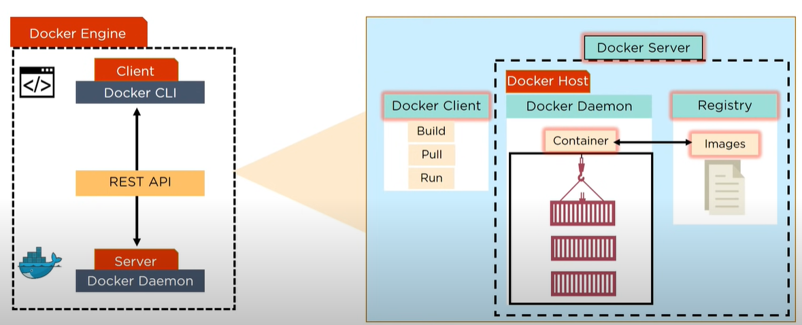
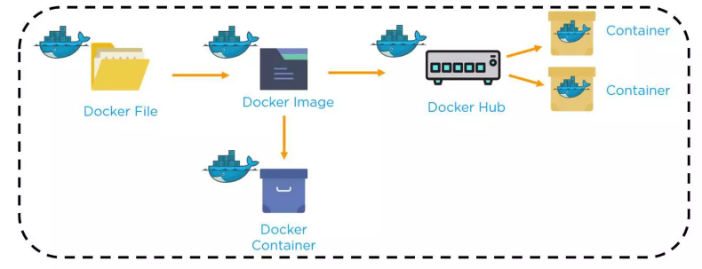

```{r setup, include=FALSE}
library(knitr)
library(tidyverse)
library(tibble)
options(warn=-1)
```

<!-- #region -->

\newpage


## What is Docker?

Docker is an open-source platform container, that enables automating the deployment and management of applications in lightweight, portable containers. Containers are software packages that include all the necessary libraries, and dependencies necessary to run the application. They provide consistency across different environments, making it easier to collaborate with others to develop, test and deploy applications. Multiple containers can be run on the same hardware. 

"Docker containers wrap a piece of software in a complete filesystem that contains everything needed to run: code, runtime, system tools, system libraries – anything that can be installed on a server. This guarantees that the software will always run the same, regardless of its environment."

Source: https://www.docker.com/what-docker


<!-- #endregion -->

## Why is it Needed?

As a software developer, one will need with others, for example a software tester during the lifecycle of the software/application development. Thus application will need to be deployed to different environments, such as the local development machine, a testing server, or a production server. Each environment may have different operating systems and configurations which may result in the application incompatibility.

With Docker, one can create a container that includes the application, along with all its dependencies and configurations. This container acts as a self-contained unit that will function consistently across different environments.


## How it helps?

For example, assume we are developing a web application on the local machine. 

Step 1: During the development phase, we can create a Dockerfile, which is a configuration file defining the setup of the container. The Dockerfile specifies the base image (e.g., an operating system) and the necessary steps to install dependencies, set up the environment, and configure the application.

Step 2: Continue developing the web application until its ready for testing. Once the application is ready, build a Docker image from the Dockerfile in Step 1. This image contains everything needed to run the application. This image can be shared with the testing team. They can run the container on their own testing server using Docker. They don't need to worry about installing dependencies or dealing with compatibility issues, as everything is already packaged in the container.

Step 3: After successful testing, while deploying the application to the production server, we can use the same Docker image. The production server might have a different operating system or configurations, but with Docker, we can ensure that the application will run exactly the same way as it did during testing. We can deploy the Docker container to the production server without the hassle of setting up the environment from scratch.


## Advantages
* Docker simplifies the deployment process and eliminates environment-related issues.
* It saves time by enabling consistency, as the application and its dependencies are packaged into a container once and then can be deployed across different environments.
* Docker facilitates collaboration among developers, testers, and operations teams.
* It is very lightweight, hence multiple Docker containers can be run on the same machine. Each container runs in isolation of the others.

\newpage
## Components

* Docker is composed of  the Docker Client and Server which communicate using a Rest API. 

* Docker Client is accessed from the terminal on the local machine and Docker Server runs the Docker Daemon and Registry as seen in the image. 

* Docker Images which are template instructions (built using the Docker File) for creating the Docker Containers. The Docker Containers are run by passing commands from the Docker Client to the Docker server. The Docker images are stored in the Docker Hub which is like Github but for Docker Images.

* Docker Registry is an open-source server-side service used for hosting and distributing images. Pull and push commands can be used to update the images on the Docker Registry.

* Images can be stored in private or public repositories


```{r  echo=FALSE, include=TRUE, out.width="100%", fig.cap="Docker Components"}

```

```{r  echo=FALSE, include=TRUE, out.width="100%", fig.cap="Overview of Creating Containers from Docker files"}

```

## Limitations

* Docker containers are lightweight, however running multiple containers simultaneously can lead to an accumulative overhead on the system resource.
* Learning Curve: Docker introduces its own set of concepts and commands, which can require some learning and adjustment for developers and operations teams who are new to containerization. 
* Security Concerns: Proper security practices, including regularly updating container images and implementing security measures at the host level, are essential to mitigate security risks.


## Reference

* Docker Tutorial For Beginners | Simplilearn, https://www.youtube.com/watch?v=rOTqprHv1YE
* Usage: https://docs.docker.com/engine/reference/commandline/build/
* Docker cheat sheet: https://github.com/wsargent/docker-cheat-sheet


